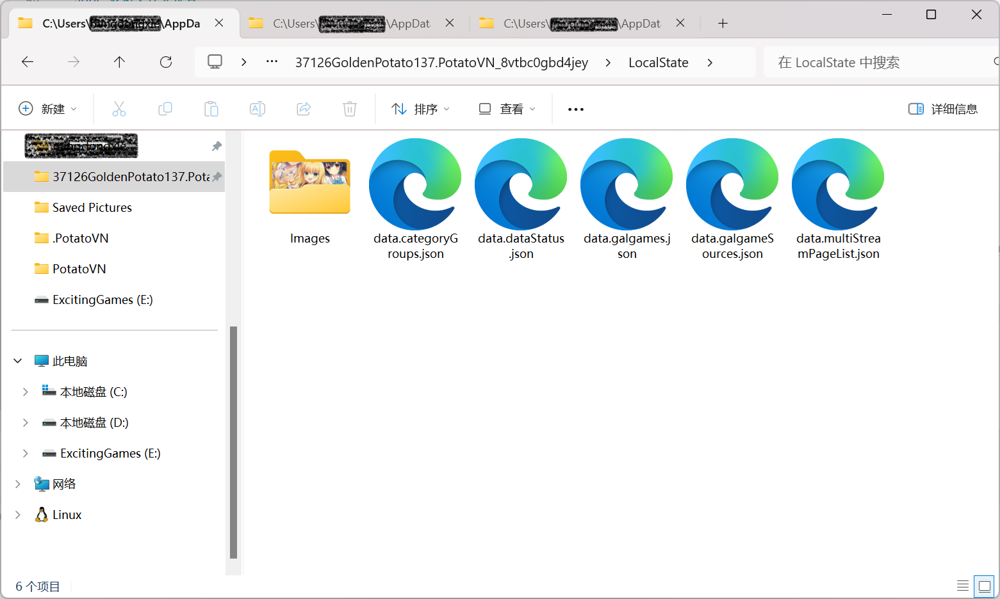
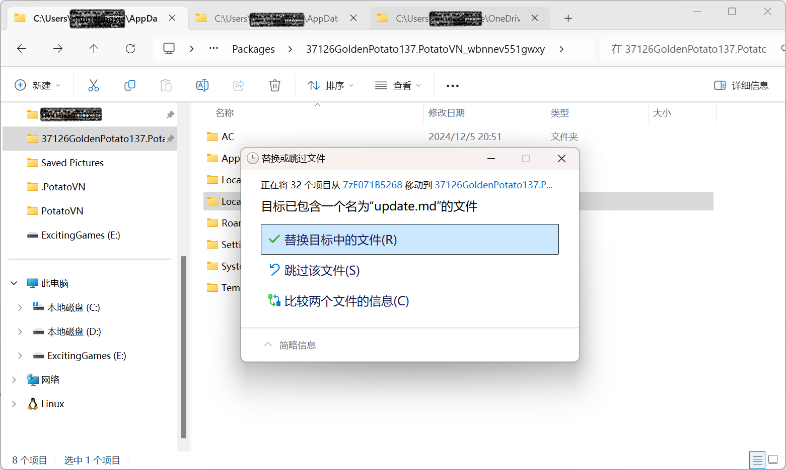

---
order: 2
---

# 管理你的数据

PotatoVN 会在你的设备上存储一些数据，这些数据包括以下几类：

* **游戏列表**：包含每个游戏的信息（标题、介绍、封面等）、每个游戏的游玩状态（游玩状态、游玩时长、评分、评价等）
* **游戏库列表**： 包含每个游戏库的信息，包括库内包含哪些游戏（指向前文的游戏列表中的游戏）、库的位置、库的封面等
  （目前只有本地文件夹这一种游戏库，之后会添加更多的游戏库（如网盘库、本地压缩库等））
* **分类列表**：包含每个分类的信息（标题、封面等）、每个分类包含哪些游戏（指向前文的游戏列表中的游戏）
* **主页记录表**: 记录主页要显示哪些列表 （如第一个列表显示最近玩的游戏、第二个列表显示某游戏库内的游戏等）
* **设置**：包含 PotatoVN 的设置（设置里面能设置的所有内容）
* **敏感数据**： PotatoVN账号、第三方账号（如Bangumi账号）的Token （加密保存）

以下为几种数据导入导出/同步方法对比：

| 方法            | 游戏列表 | 游戏库列表 | 分类列表 | 主页记录表 | 设置 | 敏感数据 | 自动同步 | 安全 | 跨电脑 |
|---------------|------|-------|------|-------|----|------|------|----|-----| 
| PotatoVN服务器同步 | ✔️   | ❌     | ❌    | ❌     | ❌  | ❌    | ✔️   | ✔️ | ✔️  |
| 导入&导出         | ✔️   | ✔️    | ✔️   | ✔️    | ❌  | ❌    | ❌    | ✔️ | ✔️  |
| 手动复制粘贴数据文件夹   | ✔️   | ✔️    | ✔️   | ✔️    | ❌  | ❌    | ❌    | ❌  | ❓   |
| .PotatoVN备份文件 | ✔️   | ❌     | ❌    | ❌     | ❌  | ❌    | ❌    | ✔️ | ✔️  |

> 注：.PotatoVN备份文件是每个游戏单独记录的，位于游戏根目录下的 `.PotatoVN`
> 文件夹中（如果没有关闭设置中的游戏备份功能），并不包含完整的游戏列表。但游戏列表可以通过库的扫描功能重新生成。

## 手动复制粘贴数据文件夹

::: danger
本操作需要你对文件夹操作有一定了解，如果你不清楚如何操作，请不要尝试。

使用本方案导入数据前请务必**备份数据文件夹**，以防操作失误导致数据丢失。
:::

::: tip
正常情况下是用不到这个方法的，这个方法一般只要在以下两种情况下会用到：

* **从1.8以下的微软商店版迁移数据到1.8以上的侧载版**：在1.8版本前没有数据导出、PotatoVN服务器同步功能，所以只能通过手动复制粘贴数据文件夹来迁移数据。
* **开发者**：开发者可能需要在不同版本之间测试数据兼容性/开发新功能时需要所在的环境是一致的，所以可能需要手动复制粘贴数据文件夹。
:::

:::info
尚未测试本数据迁移方案的跨电脑表现，可能会有bug，欢迎在issue反馈~
:::

### 数据文件夹位置

要手动复制粘贴数据文件夹，首先需要找到数据文件夹的位置。数据文件夹的位置取决于你的 PotatoVN 版本：

**微软商店版（包括微软商店测试用户组）：**

`%LOCALAPPDATA%\Packages\37126GoldenPotato137.PotatoVN_8vtbc0gbd4jey\LocalState`

**侧载版（包括抢先测试）：**

`%LOCALAPPDATA%\Packages\37126GoldenPotato137.PotatoVN_wbnnev551gwxy\LocalState`

> 注： `%LOCALAPPDATA%` 为系统环境变量，一般为 `C:\Users\你的用户名\AppData\Local`。你并不需要手动输入这一长串内容，只需在资源管理器中复制粘贴上面的路径即可。

### 复制粘贴数据文件夹
请在任何操作前**完整的**复制数据文件夹到其他地方，以防操作失误导致数据丢失。

建议直接复制整个`LocalState`文件夹，下图为数据文件夹的截图（各版本可能内容不一样）

### 导入数据

把复制出来的数据文件夹粘贴到新的 PotatoVN 版本（另一个版本、另一台电脑等）的数据文件夹位置，覆盖原有的数据文件夹即可。

